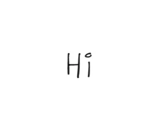
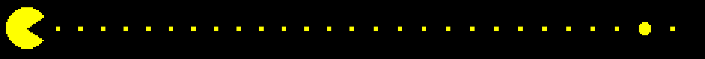

<div align = "center">  </div> <br>
<h1> <div align = "center"> Hi, I'm Abhishek 👋🏾 </div> </h1>
<div align = "center">  </div>
<br>

- 🔭 I’m currently working on designing processor cores and accelerator designs
- 🌱 I’m currently learning FPGAs, SystemVerilog, and Computer Architecture
- 👯 I’m looking to collaborate on open-source hardware projects and accelerator designs
- 🤔 I’m looking for help with designing concepts and Computer Architecture Projects
- 💬 Ask me anything related to Hardware, VLSI Design, Computer Architecture, Life, and Society in general.
- 📫 I would love to read your emails, email me at abhishekiiitdwd@gmail.com
- 😄 Pronouns: He/Him/His
- ⚡ Fun fact: ```electronic systems have no relevance in real world if they don’t have analog circuits```

<br>
<br>

I'm a final year undergraduate student at [Indian Institute of Information Technology Dharwad](https://iiitdwd.ac.in/), Karnataka, India pursuing my BTech in Electronics and Communication Engineering. In my undergrad so far I have worked with FPGAs, Microcontrollers, and Circuit Designs. I'm also an undergraduate researcher who had worked under the guidance of [Dr. Prabhu Prasad](https://prabhuprasadbm.github.io/) and [Dr. Jagadish D N](https://iiitdwd.ac.in/Dr.Jagadish.php) at the Department of CSE and ECE. I was also a research intern at Defence Research and Development Organisation, Delhi, India in the summer of 2021. <br>
I am also a huge supporter of **Open-Source Hardware and EDA Tools**. <br>

<h3>I'm always open to Research/Internship Opportunities in : 
  <br>
  <br>
    <ul>
      <li> Computer Architecture </li>
      <li> RTL Design, Verification and Synthesis </li>
      <li> FPGA prototyping </li>
      <li> Software/Hardware Co-Design </li>
      <li> Digital Integrated Circuit Design </li>
      <li> RISC V and other Processor Design </li>
      <li> HW Accelerator Design for different applications </li>
    </ul>
</h3> <br>


<p align="center">
<h4> Connect with me : </h4>
</p>
<br>

<p align="center">

  <a href="https://www.linkedin.com/in/heyshakya/" >
    
  </a>

   <a href="mailto:abhishekiiitdwd@gmail.com">
    
  </a>


  <a href="https://twitter.com/heyshakya" >
    
  </a>

   <a href="https://github.com/heyshakya">
    
  </a>

</p> 

<br>


<div align = "center">  </div> <br>


<!---
<p align="center">


</p>
<br>
-->


<!---
### Latest blogs :
- [XYZ](Link)
- [ABC](Link)
-->


